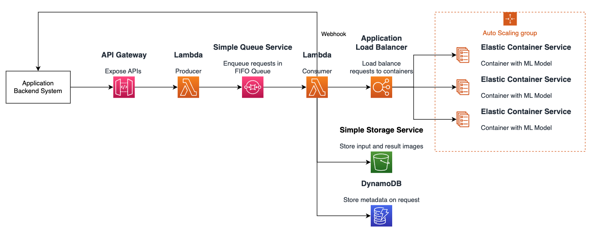

# System Design
The producer consumer design pattern separate two main components by placing a queue in the middle, letting the producers and consumers execute in different threads.


# Remote State
Using S3 as backend to store remote state under
```
terraform-remote-state
L project-name
    L {workspace}
        L terraform.tfstate
``` 

# Workspaces
Using Workspace to create 3 instances of the architecture for staging, qa, and production environment.

# Resource tagging
For identification of resource and the calculation of project deployment cost.
- owner
- description
- team
- project

# Credentials
`AWS_ACCESS_KEY_ID`, ... is exported as environtment variables.

# TODO
1. ASG module target groups
2. ECS module definition